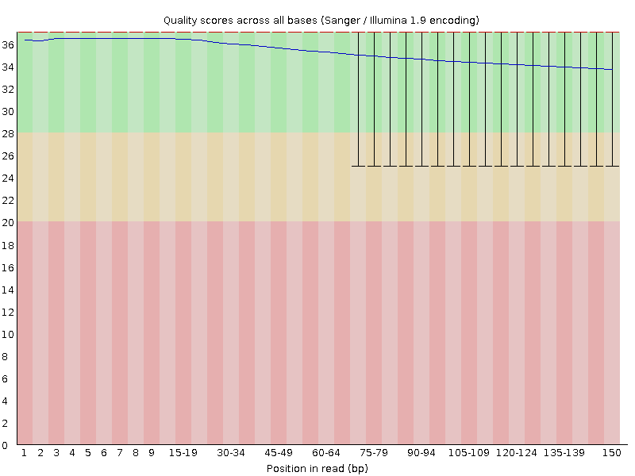

```{r setup, include=FALSE}
knitr::opts_chunk$set(echo = TRUE)
```

## Assignment Overview

In this assignment, I processed RNA-seq reads from 2 electric organ samples from the electric fish *Campylomormyrus compressirostris* ([SRR25630406](https://www.ncbi.nlm.nih.gov/sra/?term=SRR25630406) and [SRR25630407](https://www.ncbi.nlm.nih.gov/sra/?term=SRR25630407)).

All work was completed on Talapas in a conda environment named `QAA` (Python version 3.12.11). Package information (all installed using mamba):

-   fastqc: 0.12.1
-   cutadapt: 5.1
-   trimmomatic: 0.40
-   sra-tools: 3.2.1
-   matplotlib: 3.10.6
-   star: 2.7.11b
-   gffread: 0.12.7
-   picard: 3.4.0
-   samtools: 1.22.1
-   htseq: 2.0.9

### Data Acquisition

The sra files were obtained using `prefetch`, then were converted to `.fastq` files using `fasterq-dump` (part of sra-tools). The result was 2 `.fastq` files (paired) for each sample. These `.fastq` files were zipped into `fastq.gz` files using `pigz`.

## Part 1: Read Quality Score Distributions

To generate a quality report for each `fastq.gz` file, `fastqc` was run. Shown below are some of the plots that were generated:

### Per Base N Content

**SRR25630406_1 per Base N Content (FastQC):**

```{r, echo=FALSE, fig.align="left", out.width="75%"}
knitr::include_graphics("./fastqc/SRR25630406_1_per_base_n_content.png")
```

*Figure 1.1: Percent of forward reads from SRR25630406 that were sequenced as "N" (undetermined base) at each position in read. Plot generated by FastQC.*

**SRR25630406_2 per Base N Content (FastQC):**

```{r, echo=FALSE, fig.align="left", out.width="75%"}
knitr::include_graphics("./fastqc/SRR25630406_2_per_base_n_content.png")
```

*Figure 1.2: Percent of reverse reads from SRR25630406 that were sequenced as "N" (undetermined base) at each position in read. Plot generated by FastQC.*

**SRR25630407_1 per Base N Content (FastQC):**

```{r, echo=FALSE, fig.align="left", out.width="75%"}
knitr::include_graphics("./fastqc/SRR25630407_1_per_base_n_content.png")
```

*Figure 1.3: Percent of forward reads from SRR25630407 that were sequenced as "N" (undetermined base) at each position in read. Plot generated by FastQC.*

**SRR25630407_2 per Base N Content (FastQC):**

```{r, echo=FALSE, fig.align="left", out.width="75%"}
knitr::include_graphics("./fastqc/SRR25630407_2_per_base_n_content.png")
```

*Figure 1.4: Percent of reverse reads from SRR25630407 that were sequenced as "N" (undetermined base) at each position in read. Plot generated by FastQC.*

### Per Base Quality Score

**SRR25630406_1 per Base Quality Score (FastQC):**

```{r, echo=FALSE, fig.align="left", out.width="75%"}

```

*Figure 1.5: Mean Phred quality score of forward reads from SRR25630406 at each position in read (dark blue) with error bars (black). Green area highlights good quality score range, yellow area highlights potentially problematic quality score range, and red area highlights problematic quality score range. Plot generated by FastQC.*

**SRR25630406_2 per Base Quality Score (FastQC):**

```{r, echo=FALSE, fig.align="left", out.width="75%"}

```

*Figure 1.6: Mean Phred quality score of reverse reads from SRR25630406 at each position in read (dark blue) with error bars (black). Green area highlights good quality score range, yellow area highlights potentially problematic quality score range, and red area highlights problematic quality score range. Plot generated by FastQC.*

**SRR25630407_1 per Base Quality Score (FastQC):**

```{r, echo=FALSE, fig.align="left", out.width="75%"}

```

*Figure 1.7: Mean Phred quality score of forward reads from SRR25630407 at each position in read (dark blue) with error bars (black). Green area highlights good quality score range, yellow area highlights potentially problematic quality score range, and red area highlights problematic quality score range. Plot generated by FastQC.*

**SRR25630407_2 per Base Quality Score (FastQC):**

```{r, echo=FALSE, fig.align="left", out.width="75%"}
knitr::include_graphics("./fastqc/SRR25630407_2_per_base_quality.png")
```

*Figure 1.8: Mean Phred quality score of reverse reads from SRR25630407 at each position in read (dark blue) with error bars (black). Green area highlights good quality score range, yellow area highlights potentially problematic quality score range, and red area highlights problematic quality score range. Plot generated by FastQC.*

Separately, I generated per base quality score plots using a Python script I had written previously (in the Demultiplex assignment from Bi622). These plots are shown below:

**SRR25630406_1 per Base Quality Score (Python Script):**

```{r, echo=FALSE, fig.align="left", out.width="100%"}
knitr::include_graphics("./plot_qs/SRR25630406_1_qs_dist.png")
```

*Figure 1.9: Mean Phred quality score of forward reads from SRR25630406 at each position in read. Plot generated using `plot_quality_distribution.py`.*

**SRR25630406_2 per Base Quality Score (Python Script):**

```{r, echo=FALSE, fig.align="left", out.width="100%"}
knitr::include_graphics("./plot_qs/SRR25630406_2_qs_dist.png")
```

*Figure 1.10: Mean Phred quality score of reverse reads from SRR25630406 at each position in read. Plot generated using `plot_quality_distribution.py`.*

**SRR25630407_1 per Base Quality Score (Python Script):**

```{r, echo=FALSE, fig.align="left", out.width="100%"}

```

*Figure 1.11: Mean Phred quality score of forward reads from SRR25630407 at each position in read. Plot generated using `plot_quality_distribution.py`.*

**SRR25630407_2 per Base Quality Score (Python Script):**

```{r, echo=FALSE, fig.align="left", out.width="100%"}
knitr::include_graphics("./plot_qs/SRR25630406_2_qs_dist.png")
```

*Figure 1.12: Mean Phred quality score of reverse reads from SRR25630407 at each position in read. Plot generated using `plot_quality_distribution.py`.*

The per base N distribution plots show that there are zero Ns (unknown bases) at each position across all reads, which suggest relatively high quality reads. This is supported by the per base quality score plots, which all show that the mean quality score at each position is as high as 37 at some positions and does not go below 34. The plots that I created with my Python script match the plots that were generated by FastQC. However, my Python script took longer to run compared to FastQC (each of the 4 plots took \~20 minutes with the Python script while all FastQC runs took \~20 minutes combined), despite the fact that FastQC computes and plots metrics beyond just quality score. Reasons for this include the fact that FastQC is written in Java and it can be multithreaded, allowing for parallel processing. However, FastQC used up more memory (almost 10x as much as my Python script).

Overall, the data quality of these reads is good enough for further analysis. The quality of these reads is excellent, and although some other metrics are flagged in some of the FastQC reports, they are not a cause for major concern. Per base sequence content is flagged for all `.fastq` files, however there is only an imbalance of bases at the beginning of each read, which will be cut off during the trimming process. Additionally, some sequences have high levels of duplication, however this can be expected with RNA-seq data, as some transcripts are expressed more and consequently will show up more frequently in the reads.

## Part 2: Adapter & Quality Trimming

The sequencing adapters for these reads, listed below, were found to be located towards the end of each read:

-   R1 (forward read): `AGATCGGAAGAGCACACGTCTGAACTCCAGTCA`
-   R2 (reverse read): `AGATCGGAAGAGCGTCGTGTAGGGAAAGAGTGT`

Their orientation was confirmed using the bash command `grep`. The adapters were consistently found to be located towards the end of each read (for both forward and reverse reads). The adapters were trimmed using `cutadapt`. Shown below are trimming statistics:

```{r, warning=FALSE, echo=FALSE}
library(kableExtra)

read.csv("./cutadapt/adapter_trimming_stats.csv") %>%
  kable("latex", align="c", booktabs = TRUE, caption = "Adapter Trimming Statistics") %>%
  kable_styling(latex_options = c("striped", "hold_position")) %>%
  row_spec(0, bold = TRUE, extra_css = "border-bottom: 2px solid;")
```

Following adapter trimming, reads were quality trimmed with `trimmomatic` in the following order:

1.  First 8 bases trimmed
2.  Bases with Phred quality score lower than 3 trimmed from beginning of read
3.  Bases with Phred quality score lower than 3 trimmed from end of read
4.  Starting at the 5' end, if there is any set of 5 consecutive bases with a quality score lower than 15, that portion of the read, along with the remainder of the read is trimmed off
5.  Reads shorter than 35 bases removed

Shown below are trimming statistics:

```{r, warning=FALSE, echo=FALSE}
read.csv("./trimmomatic/trimmomatic_stats.csv") %>%
  kable("latex", align="c", booktabs = TRUE, caption = "Quality Trimming Statistics") %>%
  kable_styling(latex_options = c("striped", "hold_position")) %>%
  row_spec(0, bold = TRUE, extra_css = "border-bottom: 2px solid;")
```

Only the paired files were kept (read pairs where both reads passed the quality trimming) for further processing/analysis.

Using a combination of bash commands and Python, the read length distribution for each sample (after running `trimmomatic`) was plotted to explore whether trimming differed between forward (R1) and reverse (R2) reads:

```{r, echo=FALSE, fig.align="left", out.width="90%"}
knitr::include_graphics("./trimmomatic/SRR25630406_read_length_dist.png")
```

*Figure 2.1: Read length distribution of forward (blue) and reverse (orange) SRR25630406 reads after adapter and quality trimming.*

```{r, echo=FALSE, fig.align="left", out.width="90%"}
knitr::include_graphics("./trimmomatic/SRR25630407_read_length_dist.png")
```

*Figure 2.2: Read length distribution of forward (blue) and reverse (orange) SRR25630407 reads after adapter and quality trimming.*

We would expect R2 reads to be trimmed more extensively than R1 reads because they are sequenced later on during a run, when signal intensity is not as high and reagent quality has degraded. Interestingly, in both of these plots, R1 and R2 have heavy overlap, meaning that there is no huge difference in the amount that R1 and R2 reads were trimmed. Additionally, the differences between the two plots are not discernable unless the plots are zoomed in, meaning both samples were quality trimmed in a similar manner.

## Part 3: Alignment

To prepare for alignment, the reference genome `.fasta` and `.gff` files for *Campylomormyrus compressirostris* were downloaded from Dryad. The `.gff` file was converted to a `.gtf` file using `gffread`. Then, a reference database from the genome was created using `STAR genomeGenerate`. The reads were aligned to the reference genome using `STAR alignReads`. The resulting `SAM` alignment files were compressed into `BAM` files using `samtools`. Additionally, `samtools` was used to sort and index the `BAM` files. The reads were deduplicated (reads that aligned to the same gene and contained the same UMI as other read(s) were removed) using `picard`.

I counted the number of aligned vs. not aligned reads (excluding secondary alignments) using the Python script I previously wrote for Bi621 PS8. Below is a summary:

```{r, warning=FALSE, echo=FALSE}
read.csv("./count_mapped_reads/mapped_unmapped_counts.csv") %>%
  kable("latex", align="c", booktabs = TRUE, caption = "Read Mapping Statistics") %>%
  kable_styling(latex_options = c("striped", "hold_position")) %>%
  row_spec(0, bold = TRUE, extra_css = "border-bottom: 2px solid;")
```

Finally, the deduplicated reads that aligned to each gene/feature were counted using `htseq-count`. Each sample was run through `htseq-count` twice, once where the stranded parameter was set to `yes`, and another where this parameter was set to `reverse`. The output of each run gave a table where the first column is the name of the gene/feature and the second column is the number of reads that mapped to that feature (aka a measure of expression of that gene). These files will be used for future differential gene expression analyses.

To determine the strandedness of these sequenced libraries, I compared the total number of reads that mapped to a gene/feature in the forward stranded `htseq-count` run versus the reverse stranded `htseq-count` run using the bash command `awk`. In SRR25630406, only 712,892 reads were assigned to features in the forward stranded run whereas 14,275,945 were assigned to features in the reverse stranded run (a 20-fold difference). Similarly, in SRR25630407, 675,427 reads were assigned to features in the forward stranded run and 13,725,857 in the reverse stranded run. From this, we can conclude that these libraries are reverse stranded, as many more reads properly mapped to features when the stranded parameter of `htseq-count` was set to `reverse`. R1 maps to the reverse complement of the mRNA (the antisense strand) and R2 maps to the sense strand of the mRNA. The strandedness of the libaries can also be confirmed by looking at the FAQ section for the [library prep kit product page](https://www.revvity.com/product/nex-rapid-dir-rna-seq-kit-2-0-8rxn-nova-5198-01#product-overview), where they specify that dUTP is corporated into the libraries during second strand cDNA synthesis, a popular method for producing strand-specific libraries.
