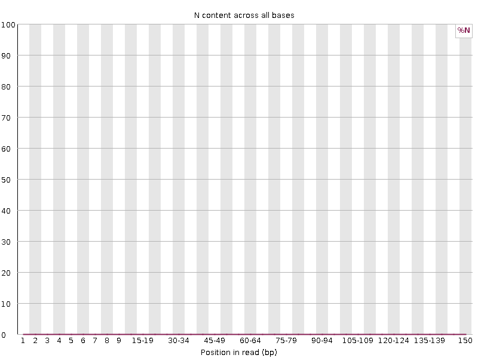
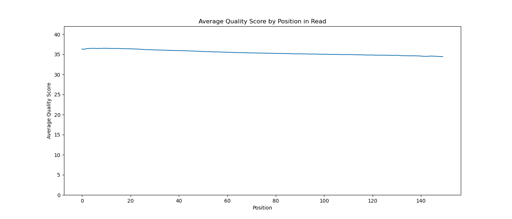

```{r setup, include=FALSE}
knitr::opts_chunk$set(echo = TRUE)
```

## Assignment Overview

In this assignment, I processed RNA-seq reads from 2 electric organ samples from the electric fish *Campylomormyrus compressirostris* ( [SRR25630406](https://www.ncbi.nlm.nih.gov/sra/?term=SRR25630406) and [SRR25630407](https://www.ncbi.nlm.nih.gov/sra/?term=SRR25630407)).

All work was completed on Talapas in a conda environment named QAA (Python version 3.12.11). Package information (all installed using mamba):

-   fastqc: 0.12.1
-   cutadapt: 5.1
-   trimmomatic: 0.40
-   sra-tools: 3.2.1
-   matplotlib: 3.10.6
-   star: 2.7.11b
-   gffread: 0.12.7
-   picard: 3.4.0
-   samtools: 1.22.1
-   htseq: 2.0.9

### Data Acquisition

The sra files were obtained using `prefetch`, then were converted to fastq files using `fasterq-dump` (part of sra-tools). The result was 2 fastq files (paired) for each sample. These fastq files were zipped using `pigz`.

## Part 1: Read Quality Score Distributions

To generate quality reports for each fastq.gz file, `fastqc` was run. Shown below are some of the plots that were generated:

### Per Base N Content

SRR25630406_1 per Base N Content (FastQC): 

SRR25630406_2 per Base N Content (FastQC): 

SRR25630407_1 per Base N Content (FastQC): 

SRR25630407_2 per Base N Content (FastQC): 

### Per Base Quality Score

SRR25630406_1 per Base Quality Score (FastQC): 

SRR25630406_2 per Base Quality Score (FastQC): 

SRR25630407_1 per Base Quality Score (FastQC): 

SRR25630407_2 per Base Quality Score (FastQC): 

Separately, I generated per base quality score plots using a Python script I had written previously (in the Demultiplex assignment from Bi622). These plots are shown below:

SRR25630406_1 per Base Quality Score (Python Script): 

SRR25630406_2 per Base Quality Score (Python Script): 

SRR25630407_1 per Base Quality Score (Python Script): 

SRR25630407_2 per Base Quality Score (Python Script): 

The per base N distribution plots show that there are zero or very few Ns (unknown bases) at each position across all reads, which suggest relatively high quality reads. This is supported by the per base quality score plots, which all show that the mean quality score at each position is as high as 37 at some positions and does not go below 34. The plots that I created with my Python script match the plots that were generated by FastQC.

## Part 2: Adapter & Quality Trimming

The sequencing adapters for these reads, listed below, were found to be located towards the end of each read:

```         
- R1: AGATCGGAAGAGCACACGTCTGAACTCCAGTCA
- R2: AGATCGGAAGAGCGTCGTGTAGGGAAAGAGTGT
```

Their orientation was confirmed using the bash command `grep`. Then, the adapters were trimmed using `cutadapt`. Shown below are trimming statistics:


Following adapter trimming, reads were quality trimmed with `trimmomatic`. Shown below are trimming statistics:


Only the paired files were kept (read pairs where both reads passed the quality trimming).

Using a combination of bash commands and Python, the read length distribution for each sample was plotted to explore whether trimming differed between forward (R1) and reverse (R2) reads:


In both of these plots, R1 and R2 have heavy overlap, meaning that there is no huge difference in the amount that R1 and R2 reads were trimmed. Additionally, the differences between the two plots are not discernable unless the plots are zoomed in, due to the large scale on the y-axis.
